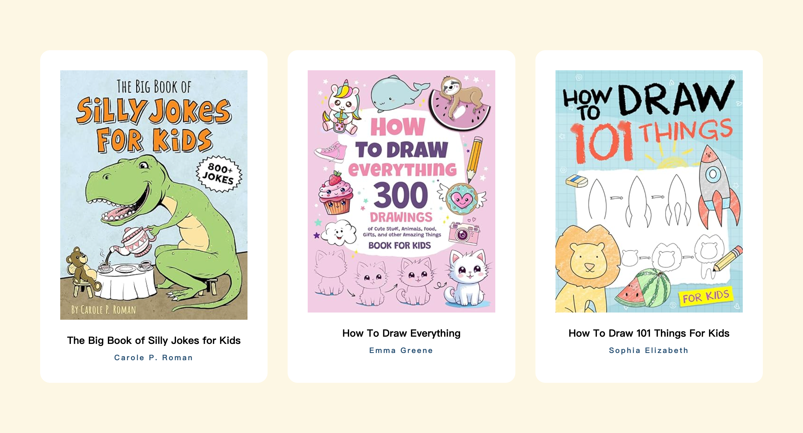

<h1>React Basic</h1>

用一个 Book List 学习 React 中的基本概念：组件、props 和 Events 等。



<h2>Table of Contents</h2>

- [Use CSS in JSX](#use-css-in-jsx)
  - [External Styles](#external-styles)
  - [Inline Styles](#inline-styles)
- [Use JavaScript in JSX](#use-javascript-in-jsx)
- [Local Images](#local-images)
- [Props](#props)
  - [Children Props](#children-props)
  - [CSS Trick](#css-trick)
- [Data: Object \& Mapping](#data-object--mapping)
  - [对象解构](#对象解构)
- [Key Prop](#key-prop)
  - [在哪里设置 Key Prop](#在哪里设置-key-prop)
- [Object as a Prop](#object-as-a-prop)
- [Event](#event)
  - [Form](#form)
  - [Anonymous Function](#anonymous-function)
- [Prop Drilling](#prop-drilling)
- [Mindset](#mindset)

## Use CSS in JSX

### External Styles

1. 导入 CSS 文件时一定要加 `css` 拓展名，导入 JavaScript/JSX 文件则不是必须要拓展名
   ```javascript
   import './index.css';
   ```

### Inline Styles

> `{}` in JSX means going back to JS Land.

1. 方法 1：在 JSX 元素中添加 CSS，用 `style={{Java Script Object}}`。
   ```jsx
   const Author = () => (
     <h4 style={{ color: '#161A30', fontSize: '0.75rem', marginTop: '0.5rem' }}>
       Carole P. Roman
     </h4>
   );
   ```
2. 方法 2：Set up reference
   ```jsx
   const Author = () => {
     const inlineHeadingStyles = {
       color: '#161A30',
       fontSize: '0.75rem',
       marginTop: '0.5rem',
     };
     return <h4 style={inlineHeadingStyles}>Carole P. Roman</h4>;
   };
   ```

## Use JavaScript in JSX

> value in `{}` must be an expression (return value), can't be a statement.
> 需要用在 JSX 中用 JavaScript 时，就在 `{}` 中写 JavaScript 代码，不仅能获取变量，也能用方法，比如：`{title.toUpperCase()}`

1. Expression ✅ - 可以写在组件里，可以写在组件外，也可以写在外部文件然后导入。
   ```jsx
   const Book = () => {
     const title = 'The Big Book of Silly Jokes for Kids';
     return <h2>{title}</h2>;
   };
   ```
2. Statement ❌
   ```jsx
   const Book = () => {
   // This will not work
   return <h2>{let x = 6}</h2>
   }
   ```

## Local Images

React 项目中添加图片有 3 种方法：

1. External Images - 用图片的 URL
2. Local Images (`public` folder) - less performant, assets don't get optimized.
   - 放在 `public` 文件夹中的图片，引用时只需要用`./`，因为它们在同一个服务器下。
     ```html
     
     ```
3. ✅ Local Images (`src` folder) - assets get optimized.

## Props

> props 是用于在组件之间传递数据的机制，用于将数据从一个组件传递到另一个组件。
> props 是只读的，这意味着一旦组件接收到 props，就无法更改它们。
> props will only display if it's actually provided

1. 直接在元素传递 props 时
   1. 如果是 `string` 用引号
   2. 如果是 `number` 用花括号 `{}`
   ```jsx
   <Book title="random title" number={1} />
   ```
2. props 实际上是 Object

   ```jsx
   function BookList() {
   return <Book title="random title"  number={1} />
   }

   const Book = (props) => {
     return (
       <p>{props.title}</p>
       <p>{props.number}</p>
     )
   }
   ```

### Children Props
> We will only use Children Props in Context API

**Chirdren props** 是在组件调用或渲染时放置在的 opening tag `<component>`和组件的 closing tag `</component>` 之间的内容。

比如在其中一个组件想添加额外的内容：
```jsx
// 父元素
function BookList() {
  return (
    <section className="booklist">
      <Book
      ...
      >

      <p>Lorem ipsum, dolor sit amet consectetur adipisicing elit. Accusantium possimus architecto eveniet facere magnam odit dolores repellendus reiciendis, ex aliquam officiis quaerat eius ratione id a perferendis eum assumenda itaque?</p>
      <button>Click Me</button>

      </Book>

      <Book
        ...
      />
    </section>
  );


//要渲染在组件标签之间的内容，要用 children props
  const Book = ({ ..., children }) => {
  return (
    <article className="book">
      ...

      {children};
    </article>
  );
};
}
```

### CSS Trick
在 Grid 中，如果其中一个元素拉长了，其他元素也会跟着拉长，让每个元素都根据自己的内容自适应长度，可以用：
```css
.grid-container {
  display: grid;
  grid-template-columns: repeat(3, 1fr);
  align-itmes: start; /* key code */
}
```

## Data: Object & Mapping
1. 在 React 中，不能直接 render Objects
2. 所以要用 `map()` 遍历和返回每一个属性

### 对象解构

下面这段代码中的 `const { img, title, author } = book;` 是 ES6 的对象结构，从对象中提取多个属性并将它们赋值给变量。

与其重复访问 book 对象的属性（如`book.img`、`book.title`、`book.author`），不如一次性提取它们，并直接使用`img`、`title`和`author`。
```jsx
function BookList() {
  return (
    <section className="booklist">
      {books.map((book) => { 
        const { img, title, author } = book;
        return <Book img={img} title={title} author={author} />
      })}
    </section>
  );
}
```

## Key Prop

> Keys 是 React 中用于标识列表中每个元素的唯一标识符。在 React 使用列表时，每个列表项都需要一个唯一的key prop。
> 唯一的 key 这有助于React识别哪些项目已经改变（添加/删除/重新排序）。唯一的key有助于React更好地管理组件状态和性能。

Key props 是唯一的，不一定需要是数字
- 不要使用数组的索引作为key
- 不要使用不稳定的key，比如使用Math.random()生成的key。

### 在哪里设置 Key Prop
在遍历数据的地方设置 Key Props，在返回的 item 上设置。（set on the item that you're returning）

## Object as a Prop
当有一个 Object，需要一个一个传递 Object 中的属性作为 props，用 Spread Operator `...`

```jsx
function BookList() {
  return (
    <section className="booklist">
      {books.map((book) => { 
        return <Book {...book} key={book.id} />
      })}
    </section>
  );
}

const Book = ({ img, title, author }) => {
  return (
    <article className="book">
      
      <h2>{title}</h2>
      <h4>{author}</h4>
    </article>
  );
};
```

## Event
1. 常用的Event有3个：
   - `onClick` - 点击事件
   - `onSubmit` - 提交事件
   - `onChange` - input中的内容改变
2. 处理事件需要3个东西：元素（element）、事件（event）和回调函数（callback function）
    ```jsx
    const EventExample = () => {
      const handleClick = () => {
        console.log('handle click')
      }

      return <button onClick={handleClick}>Click Me</button>
    };
    ```

### Form

1. 用 `event.target.value` 获取 `input` 的值
    ```jsx
    const EventExample = () => {
      const handleInputForm = (e) => {
        console.log(e.target.value);
      };

      return <input type="text" onChange={handleInputForm} />
    };
    ```
2. 表单的默认行为是将数据提交到一个URL，可以用 `preventDefault` 阻止事件的默认行为。
3. 响应表单提交事件
    ```jsx
    const ExampleFormSubmission = () => {
      const handleFormSubmission = (e) => {
        e.preventDefault();
        console.log('form submitted');
      };

      return <form onSubmit={handleFormSubmission}>
          <h1>Form</h1>
          <input type="text" />
      </form>
    }
    ```
4. 用按钮响应表达提交事件
   1. 提交函数写在`form`元素里
    ```jsx
    const ExampleFormSubmission = () => {
      const handleFormSubmission = (e) => {
        e.preventDefault();
        console.log('form submitted');
      };

      return <form onSubmit={handleFormSubmission}>
          // ...
          <input type="text" />
          <button type="submit">Submit</button>
      </form>
    }
    ```
    2. 提交函数写在 `button` 里
    > `type="button"`不会提交表单。
        ```jsx
    const ExampleFormSubmission = () => {
      const handleFormSubmission = (e) => {
        e.preventDefault();
        console.log('form submitted');
      };

      return <form>
          // ...
          <input type="text" />
          <button type="submit" onClick={handleFormSubmission}>Submit</button>
      </form>
    }
    ```

### Anonymous Function
Instead of 在事件中传递回调函数，可以在事件中直接写匿名函数。

    ```jsx
    return <button onClick={() => console.log('Hello World')}>Click me</button>
    ```

## Prop Drilling
> React data flow: can only pass props down

Prop Drilling 是父组件将数据传递给子组件，然后子组件再将数据传递给它们自己的子组件，以此类推，直到数据到达需要使用它的目标组件为止。

但这种方式会导致代码冗余，降低可维护性。

应该用 Redux 或 Context API 来传递数据，避免用 Prop Drilling。

## Mindset

1. 添加组件时，先随便在组件里写一点内容，确保组件有被正确加载，再写真正的代码逻辑。